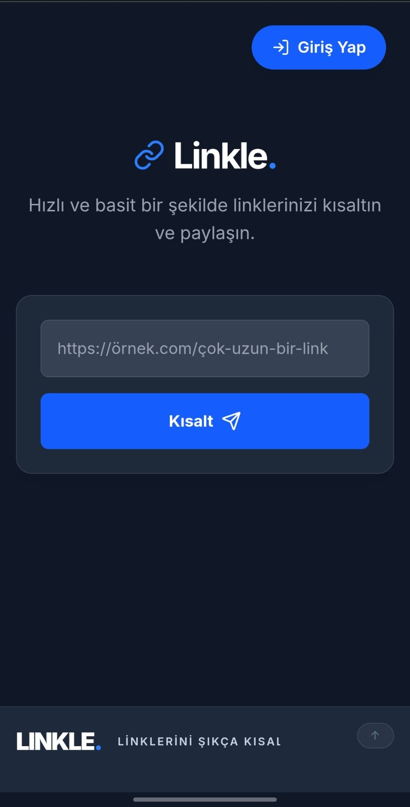
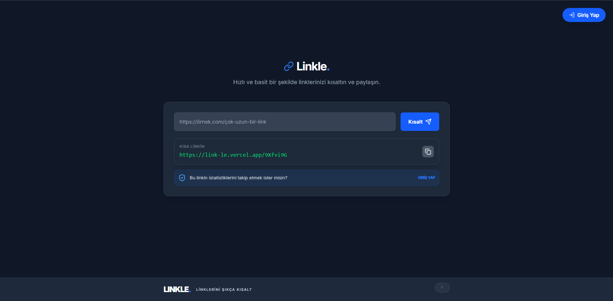
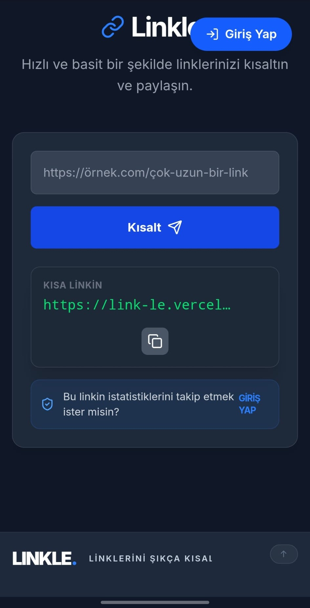
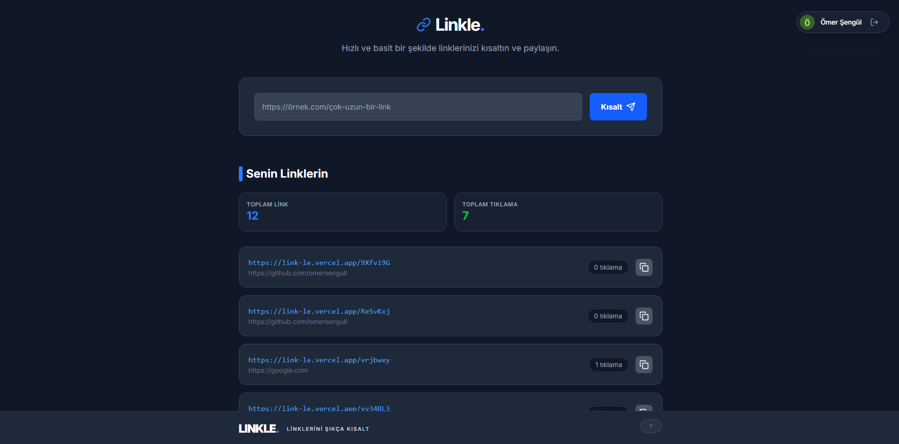
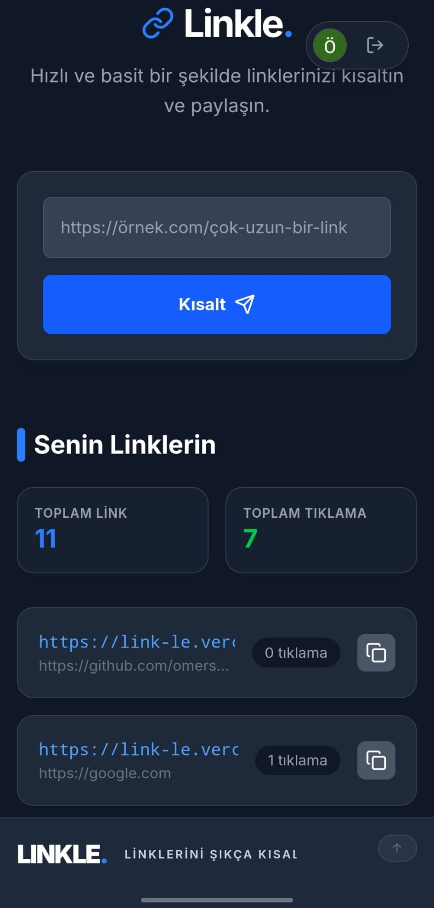
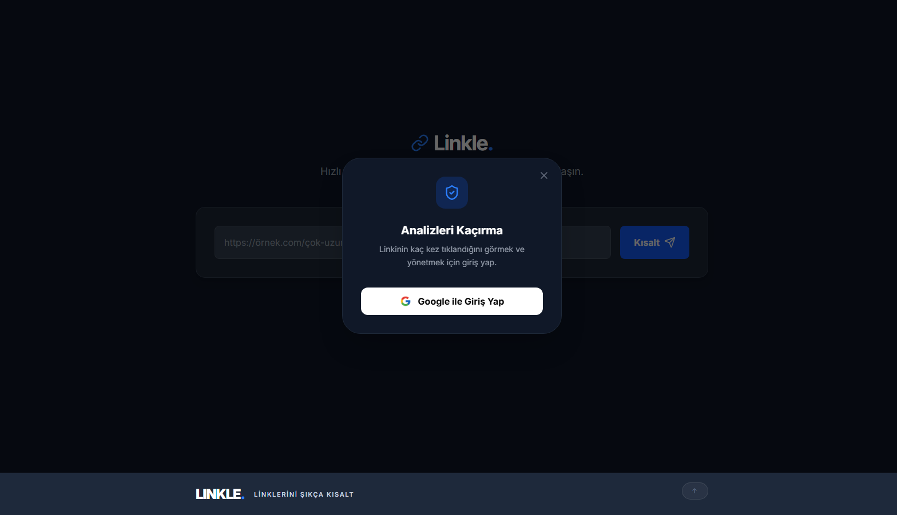

# 🔗 Linkle - Modern URL Shortener

Linkle is a modern web application that transforms long, complex web addresses into stylish, short, and trackable links in seconds.

🚀 **[View Live Demo](https://link-le.vercel.app)**

---

## 📸 Screenshots

| Desktop View | Mobile Responsiveness |
| :---: | :---: |
|  |   |
|  |  |
|  |  |
|  |  |

---

## ✨ Features

- ⚡ **Fast Shortening:** Secure and unique short code generation using `nanoid`.
- 🛡️ **Security & Rate Limiting:** 5 requests per 60 seconds limit using Upstash Redis.
- 👤 **User Dashboard:** Manage your own links by signing in with Google Auth (NextAuth).
- 📊 **Analytics Tracking:** View real-time total click counts for each link.
- 🔄 **Smart Synchronization:** Automatically sync links created while signed out to your account once you log in.
- 📱 **Fully Responsive:** Flawless experience across all screen sizes.

---

## 🛠️ Tech Stack

- **Frontend:** Next.js 15 (App Router), React, Tailwind CSS, Framer Motion
- **Backend:** Next.js API Routes, Supabase (PostgreSQL)
- **Language:** TypeScript
- **Auth:** Next-Auth (Google Provider)
- **Storage/Cache:** Redis (Upstash)
- **Validation:** Zod
